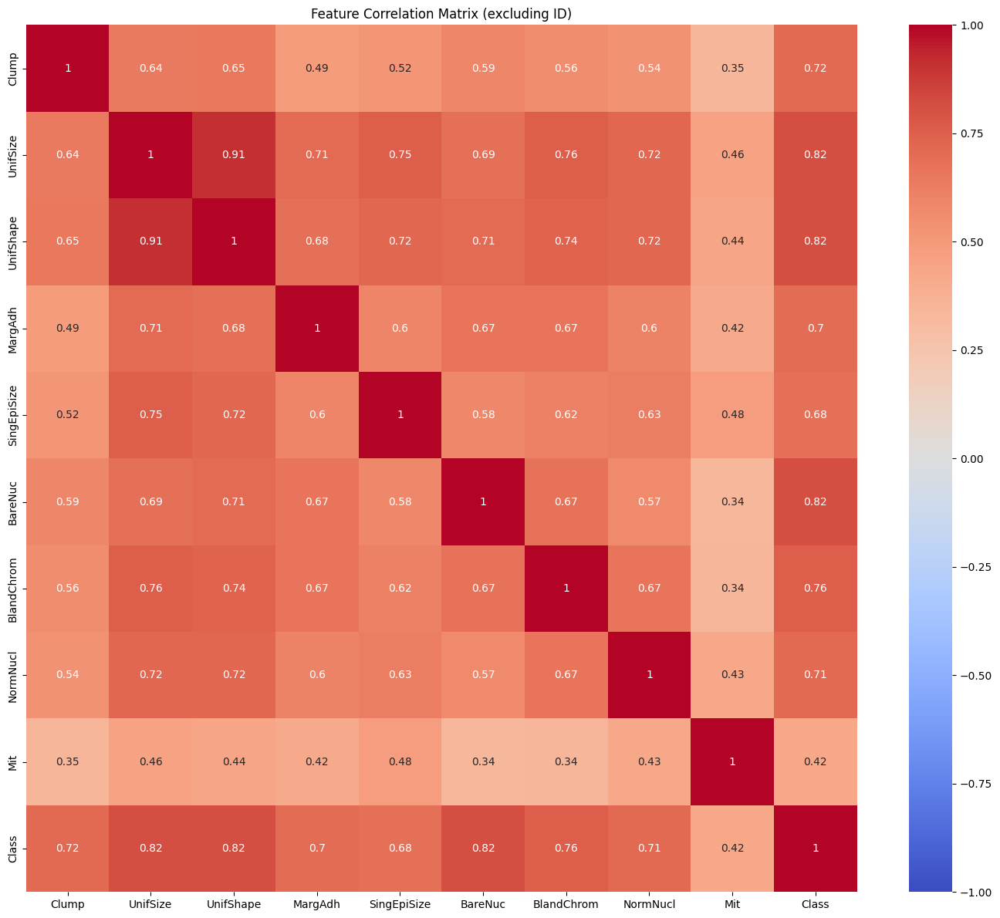

# Breast-Cancer-Data-Analysis
Exploratory data analysis and machine learning models on breast cancer dataset.
# 🩺 Breast Cancer Data Analysis

## 📌 Project Overview
This project focuses on analyzing the **Breast Cancer Wisconsin dataset** using Python.  
The goal is to perform exploratory data analysis (EDA), visualize patterns, and build machine learning models to classify tumors as **benign** or **malignant**.

## 🛠️ Tools & Libraries
- Python  
- Pandas  
- Matplotlib & Seaborn  
- Scikit-learn  

## 📂 Dataset
- Source: Available from `sklearn.datasets` (`load_breast_cancer`)  
- Size: 699 samples with 10 features describing cell characteristics  

## 📊 Steps
1. **Data Cleaning**: Ensuring no missing values and preparing the dataset.  
2. **Exploratory Data Analysis (EDA)**: Statistical summary and data visualization.  
3. **Feature Analysis**: Identifying the most important predictors.  
4. **Modeling**: Training classification models (Logistic Regression, XGboost, Decision Tree)
5. **Evaluation**: Measuring accuracy, precision, recall,F1 score and confusion matrix.  

## 📈 Results
- Logistic Regression achieved ~97.14% accuracy.  
- XGboost achieved ~96% accuracy.
- Decision Tree achieved  ~95% accuracy.

📷 Example Visualization:  
  

## ▶️ How to Run
1. Clone this repository or download the files.  
2. Open the Jupyter Notebook: `breast_cancer_analysis.ipynb`.  
3. Run all cells to reproduce the analysis and results.  

## 👩‍💻 About
This project was created as part of my data analysis and machine learning practice.  
It demonstrates how exploratory analysis and classification models can be applied to healthcare datasets.
